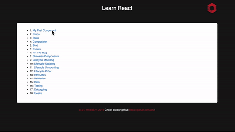

# React Crash Course

[![Build Status][travis-image]][travis-url]

This is the Read Me for the React Crash Course application tutorial.





## 1. Install the dependencies

```bash
$ yarn
```

Alternative:

```bash
$ npm install
```

## 2. Start the server

```bash
$ yarn start
```

Alternative:

```bash
$ npm start
```

## 3. Open [http://localhost:2424](http://localhost:2424)

[//]: # (Metadata)

[travis-image]: https://img.shields.io/travis/dbader/node-datadog-metrics/master.svg?style=flat-square
[travis-url]: https://travis-ci.org/dbader/node-datadog-metrics